Red, Red Wine
================
Jason Horowitz
March 21, 2018

Red, Red Wine by Jason Horowitz
===============================

### Intro

Objective of this project is to perform EDA (exploratory data anlalysis) examining relationships among variables in the red wine dataset. This is one of two datasets presented by Udacity which relate to red and white variants of Portuguese Vinho Verde wine.

There are a total of 1599 observations (wines) in the dataset displaying twelve variables including eleven input variables (based on physicochemical tests) and one output variable based on sensory data, a quality score.

The physico-chemical variables are (descriptive text included as indicated):

1.  **fixed acidity** (tartaric acid - g / dm^3): most acids involved with wine are fixed or nonvolatile (do not evaporate readily).
2.  **volatile acidity** (acetic acid - g / dm^3): the amount of acetic acid in wine, which at too high of levels can lead to an unpleasant, vinegar taste.
3.  **citric acid** (g / dm^3): found in small quantities, citric acid can add 'freshness' and flavor to wines.
4.  **residual sugar** (g / dm^3): the amount of sugar remaining after fermentation stops, it's rare to find wines with less than 1 gram/liter and wines with greater than 45 grams/liter are considered sweet.
5.  **chlorides** (sodium chloride - g / dm^3): the amount of salt in the wine
6.  **free sulfur dioxide** (mg / dm^3): the free form of SO2 exists in equilibrium between molecular SO2 (as a dissolved gas) and bisulfite ion; it prevents microbial growth and the oxidation of wine.
7.  **total sulfur dioxide** (mg / dm^3): amount of free and bound forms of S02; in low concentrations, SO2 is mostly undetectable in wine, but at free SO2 concentrations over 50 ppm, SO2 becomes evident in the nose and taste of wine.
8.  **density** (g / cm^3): the density of wine is close to that of water depending on the percent alcohol and sugar content.
9.  **pH**: describes how acidic or basic a wine is on a scale from 0 (very acidic) to 14 (very basic); most wines are between 3-4 on the pH scale
10. **sulphates** (potassium sulphate - g / dm3): a wine additive which can contribute to sulfur dioxide gas (S02) levels, wich acts as an antimicrobial and antioxidant.
11. **alcohol** (% by volume): the percent alcohol content of the wine.
12. **quality** (score between 0 and 10):the median of at least 3 evaluations made by wine experts with grading between 0 (very bad) and 10 (very excellent).

Univariate Plots Section
========================

> **Tip**: In this section, you should perform some preliminary exploration of your dataset. Run some summaries of the data and create univariate plots to understand the structure of the individual variables in your dataset. Don't forget to add a comment after each plot or closely-related group of plots! There should be multiple code chunks and text sections; the first one below is just to help you get started.

    ## 'data.frame':    1599 obs. of  13 variables:
    ##  $ X                   : int  1 2 3 4 5 6 7 8 9 10 ...
    ##  $ fixed.acidity       : num  7.4 7.8 7.8 11.2 7.4 7.4 7.9 7.3 7.8 7.5 ...
    ##  $ volatile.acidity    : num  0.7 0.88 0.76 0.28 0.7 0.66 0.6 0.65 0.58 0.5 ...
    ##  $ citric.acid         : num  0 0 0.04 0.56 0 0 0.06 0 0.02 0.36 ...
    ##  $ residual.sugar      : num  1.9 2.6 2.3 1.9 1.9 1.8 1.6 1.2 2 6.1 ...
    ##  $ chlorides           : num  0.076 0.098 0.092 0.075 0.076 0.075 0.069 0.065 0.073 0.071 ...
    ##  $ free.sulfur.dioxide : num  11 25 15 17 11 13 15 15 9 17 ...
    ##  $ total.sulfur.dioxide: num  34 67 54 60 34 40 59 21 18 102 ...
    ##  $ density             : num  0.998 0.997 0.997 0.998 0.998 ...
    ##  $ pH                  : num  3.51 3.2 3.26 3.16 3.51 3.51 3.3 3.39 3.36 3.35 ...
    ##  $ sulphates           : num  0.56 0.68 0.65 0.58 0.56 0.56 0.46 0.47 0.57 0.8 ...
    ##  $ alcohol             : num  9.4 9.8 9.8 9.8 9.4 9.4 9.4 10 9.5 10.5 ...
    ##  $ quality             : int  5 5 5 6 5 5 5 7 7 5 ...

``` r
# let's turn X into a factor
rw$X <- factor(rw$X)
# now let's rename X to something more appropriate like 'id'
colnames(rw)[1] <- "id"
# it may make sense to turn quality into a factor and then facet by quality
```

``` r
summary(rw)
```

    ##        id       fixed.acidity   volatile.acidity  citric.acid   
    ##  1      :   1   Min.   : 4.60   Min.   :0.1200   Min.   :0.000  
    ##  2      :   1   1st Qu.: 7.10   1st Qu.:0.3900   1st Qu.:0.090  
    ##  3      :   1   Median : 7.90   Median :0.5200   Median :0.260  
    ##  4      :   1   Mean   : 8.32   Mean   :0.5278   Mean   :0.271  
    ##  5      :   1   3rd Qu.: 9.20   3rd Qu.:0.6400   3rd Qu.:0.420  
    ##  6      :   1   Max.   :15.90   Max.   :1.5800   Max.   :1.000  
    ##  (Other):1593                                                   
    ##  residual.sugar     chlorides       free.sulfur.dioxide
    ##  Min.   : 0.900   Min.   :0.01200   Min.   : 1.00      
    ##  1st Qu.: 1.900   1st Qu.:0.07000   1st Qu.: 7.00      
    ##  Median : 2.200   Median :0.07900   Median :14.00      
    ##  Mean   : 2.539   Mean   :0.08747   Mean   :15.87      
    ##  3rd Qu.: 2.600   3rd Qu.:0.09000   3rd Qu.:21.00      
    ##  Max.   :15.500   Max.   :0.61100   Max.   :72.00      
    ##                                                        
    ##  total.sulfur.dioxide    density             pH          sulphates     
    ##  Min.   :  6.00       Min.   :0.9901   Min.   :2.740   Min.   :0.3300  
    ##  1st Qu.: 22.00       1st Qu.:0.9956   1st Qu.:3.210   1st Qu.:0.5500  
    ##  Median : 38.00       Median :0.9968   Median :3.310   Median :0.6200  
    ##  Mean   : 46.47       Mean   :0.9967   Mean   :3.311   Mean   :0.6581  
    ##  3rd Qu.: 62.00       3rd Qu.:0.9978   3rd Qu.:3.400   3rd Qu.:0.7300  
    ##  Max.   :289.00       Max.   :1.0037   Max.   :4.010   Max.   :2.0000  
    ##                                                                        
    ##     alcohol         quality     
    ##  Min.   : 8.40   Min.   :3.000  
    ##  1st Qu.: 9.50   1st Qu.:5.000  
    ##  Median :10.20   Median :6.000  
    ##  Mean   :10.42   Mean   :5.636  
    ##  3rd Qu.:11.10   3rd Qu.:6.000  
    ##  Max.   :14.90   Max.   :8.000  
    ## 

### Structure and Summary of Data

Our dataset consists of 12 variables (plus an index (X) which identifies the different wines). The variables are all number or integer data types. There are a total of nearly 1600 observations in the dataset. There are no missing values and each row of the database equals one observation: so the dataset is both clean and tidy.

### Histogram of Wine Quality Scores

For our first histogram, we plotted the wine quality scores. It is notable that greater than 75% of the quality scores are concentrated in the middle (5-6) of the score range (1-10). The shape of the curve is normal-ish.

Also worth noting is that the Quality score is an integer data type despite the description that it is derived from observations of at least 3 experts. It would have been nice to have the precision of a decimal average for quality scores. On the other hand, it simplifies things by making a bin = 1 optimal for displaying the distribution.

In fact, since the ratings are distributed across six integers (3-8), it's going to make the most sense to convert this into a factor variable. The results will coincide with the following ratings:

-   3 = "Awful"
-   4 = "Poor"
-   5 = "Fair"
-   6 = "Good"
-   7 = "Very Good"
-   8 = "Superior"

``` r
# let's turn X into a factor
rw$quality <- factor(rw$quality)
str(rw$quality)
```

    ##  Factor w/ 6 levels "3","4","5","6",..: 3 3 3 4 3 3 3 5 5 3 ...

``` r
ggplot(rw) +
  geom_histogram(aes(x = quality), color = "black",
                 fill = "#F79420", stat="count")
```

    ## Warning: Ignoring unknown parameters: binwidth, bins, pad

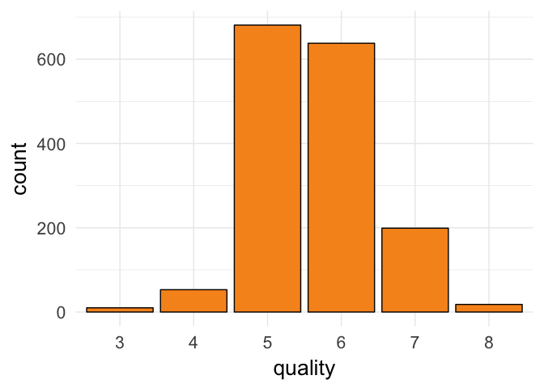

### Histograms of Other Variables

Let's look at histograms of the other variables adjusting the binwidth as appropriate to have a look at the distribution of values. I will also perform transformations on plots that require normalization.

Hopefully, plotting the variables and some minor additional research into them will give us ideas for further investigation in the bivariate and multivariate analysis to follow.

#### Fixed Acidity

``` r
# fixed acidity
ggplot(rw) +
  geom_histogram(aes(x = fixed.acidity), color = "black",
                 fill = "#FFFF66", binwidth = .1)
```

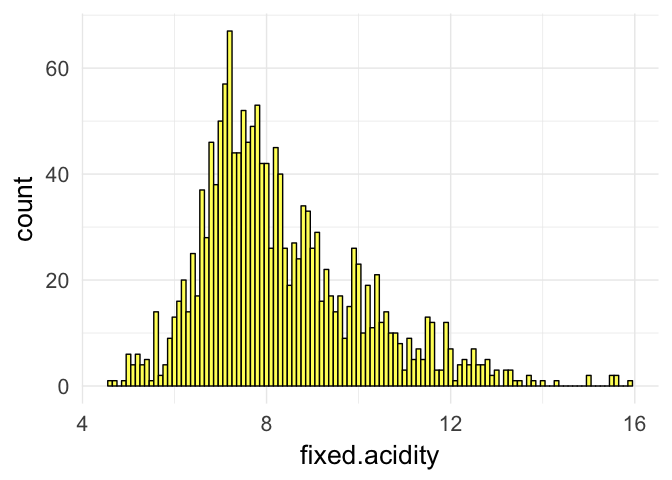 Since this appears to have a long-tail distribution, we will transform the variable using the log base 10 scale.

``` r
ggplot(rw) +
  geom_histogram(aes(x = fixed.acidity), color = "black",
                 fill = "#FFFF66", binwidth = .02) +
  scale_x_log10() +
  xlab("fixed.acidity log10")
```

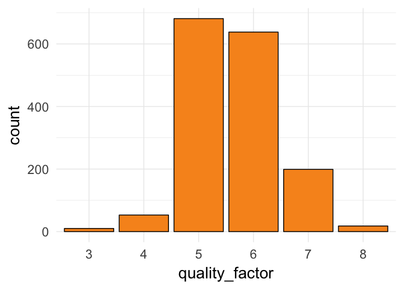 With this transformation, the distribution of the data follows a more normal distribution.

#### Volatile Acidity

``` r
# volatile acidity
ggplot(rw) +
  geom_histogram(aes(x = volatile.acidity), color = "black",
                 fill = "#CCFFCC", binwidth = .01)
```

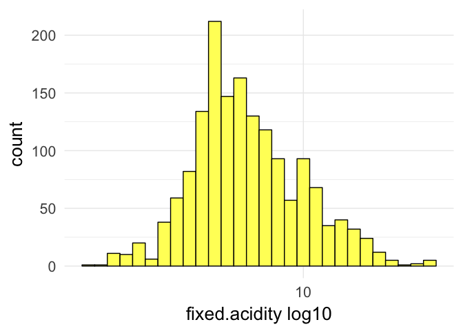 The distribution for volatile acidity also seems to be longtailed - and with some outliers. Let's perform a similar log10 transformation - also eliminating the top and bottom 1% of the values.

``` r
ggplot(rw) +
  geom_histogram(aes(x = volatile.acidity), color = "black",
                 fill = "#CCFFCC", binwidth = .02) +
  scale_x_log10() +
  xlim(quantile(rw$volatile.acidity, 0.01),quantile(rw$volatile.acidity, 0.99)) +
  xlab("volatile.acidity log10")
```

    ## Scale for 'x' is already present. Adding another scale for 'x', which
    ## will replace the existing scale.

    ## Warning: Removed 30 rows containing non-finite values (stat_bin).

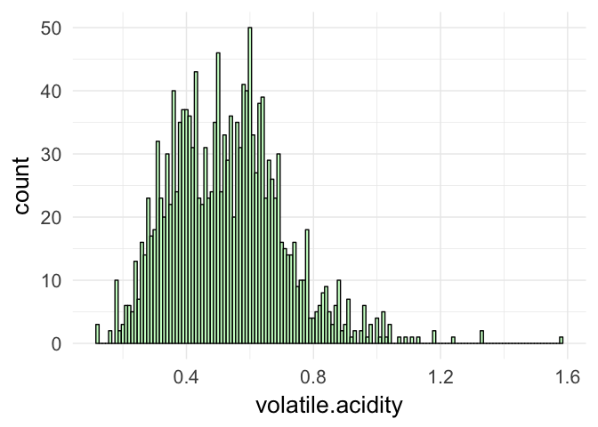 As with fixed acidity, the transformed volatile acidity data follows a somewhat more normal distribution.

#### Citric Acid

``` r
ggplot(rw) +
  geom_histogram(aes(x = citric.acid), color = "black",
                 fill = "#FF66CC", binwidth = .02)
```

 A signicant number of wines have citric acid near 0. Let's check how many actually have no trace of citric acid.

``` r
# r code to count number of items at a specific value
no_citric <- subset(rw, citric.acid == 0)
dim(no_citric)
```

    ## [1] 132  13

``` r
dim(no_citric)[1]/dim(rw)[1]
```

    ## [1] 0.08255159

So 132 items (8.2% of the observations) contain no trace of citric acid. This makes sense because the citric acid most usally found in wine is a supplment added after primary alcohol fermentation (citric acid is present only in minute quantities in grapes) In the European Union, use of citric acid for acidification is prohibited, but limited use of citric acid is permitted for removing excess iron and copper from the wine if potassium ferrocyanide is not available. [Wikipedia](https://en.wikipedia.org/wiki/Acids_in_wine#cite_note-Oxford_pg_171-6)

Also note - Citric acid imparts a citric character that enhances the taste of many white and blush wines. However, citric acid is seldom used in red wine. The distinctive citric taste may not be appropriate for many types of red wine. In addition, the risk of biological instability is much greater in red wines.[Lum Eisenman, *The Home Winemaker's Manual*](https://www.homebrewit.com/a-detailed-explanation-of-acids-used-in-wine-making)

The description that came with the dataset about citric acid adding 'freshness and flavor' to wine seems as though it may not apply to red wines. It certainly will be interesting to see how citric acid (and its absence) correlates with wine quality in this particular dataset.

#### Residual Sugar

``` r
ggplot(rw) +
  geom_histogram(aes(x = residual.sugar), color = "black",
                 fill = "#993300", binwidth = .05)
```

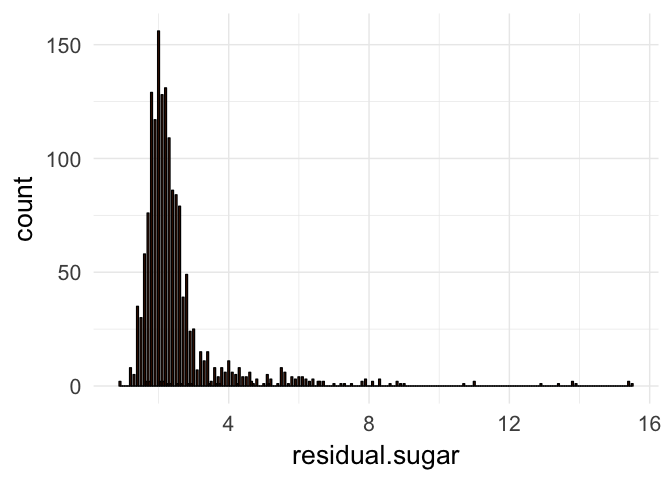 Residual sugar seems to have a very long tail, so let's perform a log 10 transformation.

``` r
ggplot(rw) +
  geom_histogram(aes(x = residual.sugar), color = "black",
                 fill = "#993300", binwidth = .05) +
  scale_x_log10() +
  xlab("residual.sugar_log10")
```

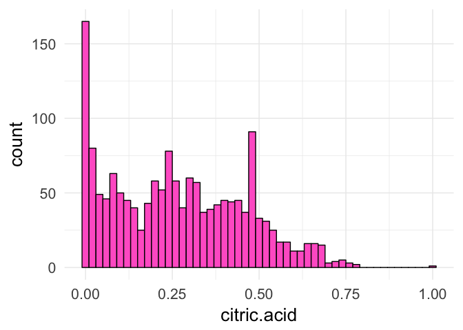 Still a long tail, but the middle of the distribution is more clearly normalish. Let's try doing this a different way to see if we can eliminate the outliers.

``` r
ggplot(rw) +
  geom_histogram(aes(x = residual.sugar), color = "black",
                 fill = "#993300", binwidth = .1) +
  scale_x_continuous(lim = c(0, quantile(rw$residual.sugar, 0.95))) +
  xlab("residual.sugar_95th percentiles")
```

    ## Warning: Removed 79 rows containing non-finite values (stat_bin).

    ## Warning: Removed 1 rows containing missing values (geom_bar).

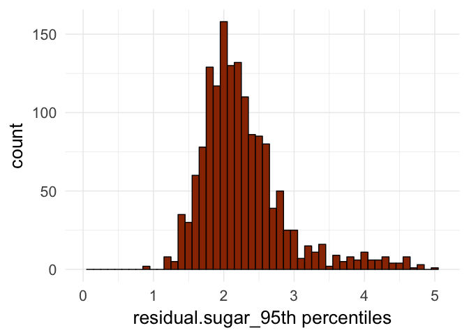 That's a little better.

#### Chlorides

``` r
ggplot(rw) +
  geom_histogram(aes(x = chlorides), color = "black",
                 fill = "#9999FF", binwidth = .005)
```

 Chlorides definitely has a long-tail, so let's try removing the outliers.

``` r
ggplot(rw) +
  geom_histogram(aes(x = chlorides), color = "black",
                     fill = "#9999FF", binwidth = .002) +
  scale_x_continuous(lim = c(quantile(rw$chlorides, 0.01), quantile(rw$chlorides, 0.95))) +
  xlab('chlorides_95thPercentile')
```

    ## Warning: Removed 96 rows containing non-finite values (stat_bin).

    ## Warning: Removed 1 rows containing missing values (geom_bar).

 This plot definitely is more normal in its appearance than the previous one.

#### Free Sulfur Dioxide

``` r
ggplot(rw) +
  geom_histogram(aes(x = free.sulfur.dioxide), color = "black",
                 fill = "#99FF99", binwidth = 1)
```

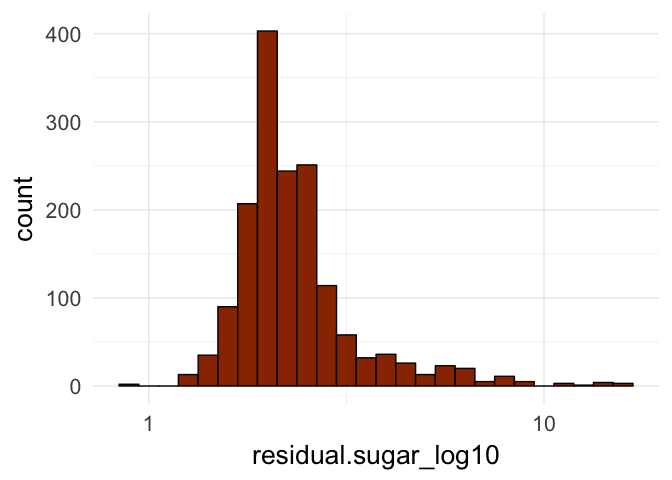 \#\#\#\# Total Sulfur Dioxide

``` r
ggplot(rw) +
  geom_histogram(aes(x = total.sulfur.dioxide), color = "black",
                 fill = "#669933", binwidth = 1)
```

 Sulfur dioxide in both its free and bound form is used as a preservative (see above). Since the plots for both are right skewed, let's perform a square root transformation on each.

First on the free sulfur dioxide:

``` r
ggplot(rw) +
  geom_histogram(aes(x = sqrt(free.sulfur.dioxide)), color = "black",
                 fill = "#99FF99", binwidth = .25)
```

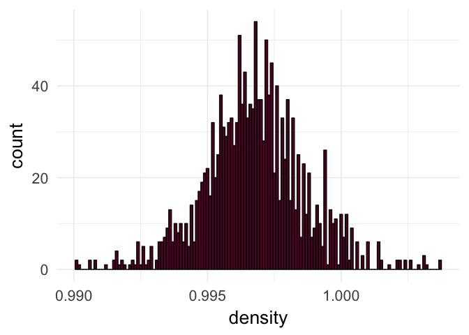 And total sulfur dioxide

``` r
ggplot(rw) +
  geom_histogram(aes(x = sqrt(total.sulfur.dioxide)), color = "black",
                 fill = "#669933", binwidth = .25)
```

 That mostly got rid of the right skew and the curves are more normal.

#### Density

``` r
ggplot(rw) +
  geom_histogram(aes(x = density), color = "black",
                 fill = "#660033", binwidth = .0005)
```

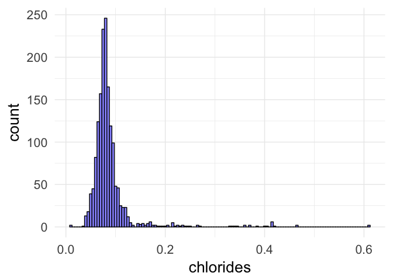 Density is a quite a normal distribution with few outliers: mean and median are almost identical.

#### pH (Overall Acidity)

``` r
ggplot(rw) +
  geom_histogram(aes(x = pH), color = "black",
                 fill = "#CC0033", binwidth = .05)
```

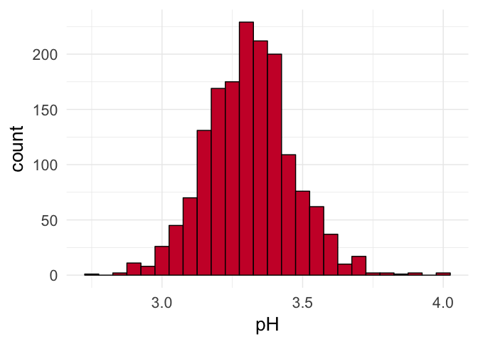

pH (overall acidity) also shows a normalish distribution with few outliers.

#### Sulphates

``` r
ggplot(rw) +
  geom_histogram(aes(x = sulphates), color = "black",
                 fill = "#CCFF00", binwidth = .05)
```

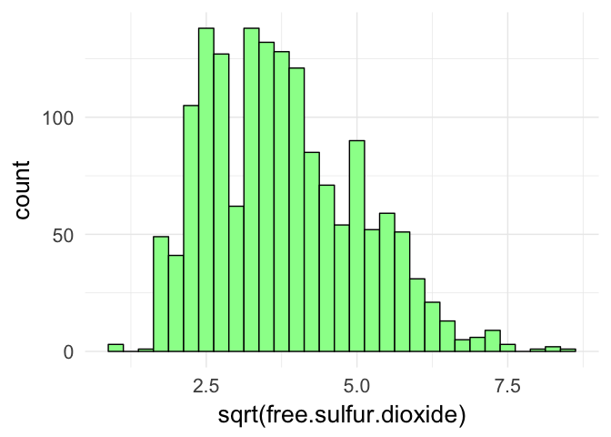

Sulphates, an additive which serves as a preservative, demonstrates a right skewed curve with a long tail. Let's see what how it looks after a square root transformation.

``` r
ggplot(rw) +
  geom_histogram(aes(x = sqrt(sulphates)), color = "black",
                 fill = "#CCFF00", binwidth = .02) +
  scale_x_continuous(lim = c(0.5, quantile(rw$sulfates, 0.95)))
```

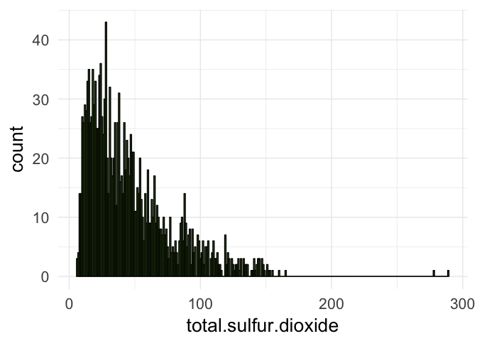 That's normalish.

#### Alcohol Content % By Volume

``` r
# alcohol content % by volume
ggplot(rw) +
  geom_histogram(aes(x = alcohol), color = "black",
                 fill = "#FF6666", binwidth = .1)
```


``` r
summary(rw$alcohol)
```

    ##    Min. 1st Qu.  Median    Mean 3rd Qu.    Max. 
    ##    8.40    9.50   10.20   10.42   11.10   14.90

Alcohol content by volume is slightly right-skewed and in the 9.5-11 range. This is fairly intutive to anyone who drinks wine. It will be interesting to look at correlations between high/low alcohol content and the quality score.

Univariate Analysis
===================

> **Tip**: Now that you've completed your univariate explorations, it's time to reflect on and summarize what you've found. Use the questions below to help you gather your observations and add your own if you have other thoughts!

### What is the structure of your dataset?

The structure of the dataset is as discussed in the "Structure and Summary" section above. One major transformation we made was converting the output variable "quality" from an integer value to a factor. A few of the input variables appear to be related of each other: pH, volatile acidity, fixed acidity and maybe, citric acid; free sulfur dioxide and total sulfur dioxide. It will be interesting to see how those items correlate with each other and with the quality score.

### What is/are the main feature(s) of interest in your dataset?

The main feature of interest is the distribution of the quality variable. More than three-quarters of the observations are of the middle two ratings which means that only about 400 items were classified at either the upper or lower extremes. It should be possible to examine that group of 'very good' or 'very bad' wines and to correlate with other variables.

### What other features in the dataset do you think will help support your investigation into your feature(s) of interest?

Biggest question for me is how/whether the different input variables correlate or predict the output variable, quality. Am particularly curious to see how alchohol level correlates with quality. Will also be interesting to see how the different acidity-related variables correlate with each other and with quality.

### Did you create any new variables from existing variables in the dataset?

I did not create any new variables, but I did convert two of the existing variables: X (renaming it 'ID') and quality into factor variables. We don't need these variables tobe summarized and it makes more intuitive sense for these variables to be factors. Have not at this point determined that it makes sense to create any new variables from the existing ones, though perhaps something will come out of the bivariate or multivariate analysis.

### Of the features you investigated, were there any unusual distributions?
\#\# Did you perform any operations on the data to tidy, adjust, or change the form
\#\#\# of the data? If so, why did you do this?

Yes, several of the variables' plots displayed a skew or a relatively large number of outliers. I transformed these variables using base-10 logarithims, square root operations, or, in a couple cases, buy cutting off the outliers. As a result, the transformed plots were easier to read and showed more normal distributions.

Bivariate Plots Section
=======================

> **Tip**: Based on what you saw in the univariate plots, what relationships between variables might be interesting to look at in this section? Don't limit yourself to relationships between a main output feature and one of the supporting variables. Try to look at relationships between supporting variables as well.

*Note* - proper way to convert factor to numeric and back is - [described in the link](https://stackoverflow.com/questions/3418128/how-to-convert-a-factor-to-integer-numeric-without-loss-of-information) **need to refactor code**

    ## 'data.frame':    1599 obs. of  5 variables:
    ##  $ quality             : Factor w/ 6 levels "3","4","5","6",..: 3 3 3 4 3 3 3 5 5 3 ...
    ##  $ alcohol             : num  9.4 9.8 9.8 9.8 9.4 9.4 9.4 10 9.5 10.5 ...
    ##  $ pH                  : num  3.51 3.2 3.26 3.16 3.51 3.51 3.3 3.39 3.36 3.35 ...
    ##  $ residual.sugar      : num  1.9 2.6 2.3 1.9 1.9 1.8 1.6 1.2 2 6.1 ...
    ##  $ total.sulfur.dioxide: num  34 67 54 60 34 40 59 21 18 102 ...

    ## 'data.frame':    1599 obs. of  5 variables:
    ##  $ quality             : Factor w/ 6 levels "3","4","5","6",..: 3 3 3 4 3 3 3 5 5 3 ...
    ##  $ alcohol             : num  9.4 9.8 9.8 9.8 9.4 9.4 9.4 10 9.5 10.5 ...
    ##  $ pH                  : num  3.51 3.2 3.26 3.16 3.51 3.51 3.3 3.39 3.36 3.35 ...
    ##  $ residual.sugar      : num  1.9 2.6 2.3 1.9 1.9 1.8 1.6 1.2 2 6.1 ...
    ##  $ total.sulfur.dioxide: num  34 67 54 60 34 40 59 21 18 102 ...

    ## 'data.frame':    1599 obs. of  5 variables:
    ##  $ quality             : num  3 3 3 4 3 3 3 5 5 3 ...
    ##  $ alcohol             : num  9.4 9.8 9.8 9.8 9.4 9.4 9.4 10 9.5 10.5 ...
    ##  $ pH                  : num  3.51 3.2 3.26 3.16 3.51 3.51 3.3 3.39 3.36 3.35 ...
    ##  $ residual.sugar      : num  1.9 2.6 2.3 1.9 1.9 1.8 1.6 1.2 2 6.1 ...
    ##  $ total.sulfur.dioxide: num  34 67 54 60 34 40 59 21 18 102 ...

``` r
# toggle quality variable factor<-->numeric (comment as appropriate) 
#rw_subset$quality <- as.numeric(rw_subset$quality)
# rw_subset$quality <- as.factor(rw_subset$quality)
# first attempt to run GGpairs function to get quick plot - done with alcohol as both numeric and factoral
ggpairs(rw_subset_fact, mapping = aes(color = quality), upper = list(combo = "dot"))
```

    ## `stat_bin()` using `bins = 30`. Pick better value with `binwidth`.
    ## `stat_bin()` using `bins = 30`. Pick better value with `binwidth`.
    ## `stat_bin()` using `bins = 30`. Pick better value with `binwidth`.
    ## `stat_bin()` using `bins = 30`. Pick better value with `binwidth`.

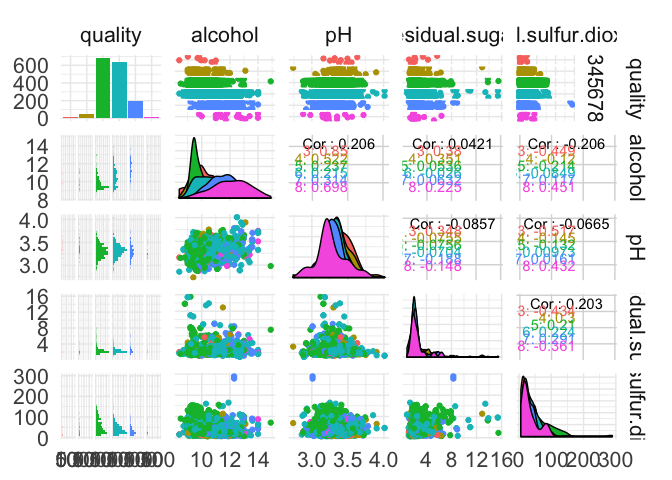

``` r
ggpairs(rw_subset_num)
```

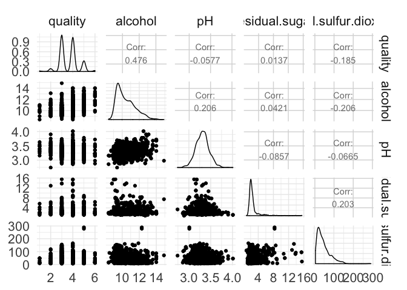

``` r
# , upper = list(continuous = wrap(cor_text, color = "red", size = 10))
# axisLabels = 'internal'
```

``` r
# toggle quality variable factor<-->numeric (comment as appropriate) 
# rw$quality <- as.numeric(rw$quality)
rw$quality <- as.factor(rw$quality)
str(rw)
```

    ## 'data.frame':    1599 obs. of  13 variables:
    ##  $ id                  : Factor w/ 1599 levels "1","2","3","4",..: 1 2 3 4 5 6 7 8 9 10 ...
    ##  $ fixed.acidity       : num  7.4 7.8 7.8 11.2 7.4 7.4 7.9 7.3 7.8 7.5 ...
    ##  $ volatile.acidity    : num  0.7 0.88 0.76 0.28 0.7 0.66 0.6 0.65 0.58 0.5 ...
    ##  $ citric.acid         : num  0 0 0.04 0.56 0 0 0.06 0 0.02 0.36 ...
    ##  $ residual.sugar      : num  1.9 2.6 2.3 1.9 1.9 1.8 1.6 1.2 2 6.1 ...
    ##  $ chlorides           : num  0.076 0.098 0.092 0.075 0.076 0.075 0.069 0.065 0.073 0.071 ...
    ##  $ free.sulfur.dioxide : num  11 25 15 17 11 13 15 15 9 17 ...
    ##  $ total.sulfur.dioxide: num  34 67 54 60 34 40 59 21 18 102 ...
    ##  $ density             : num  0.998 0.997 0.997 0.998 0.998 ...
    ##  $ pH                  : num  3.51 3.2 3.26 3.16 3.51 3.51 3.3 3.39 3.36 3.35 ...
    ##  $ sulphates           : num  0.56 0.68 0.65 0.58 0.56 0.56 0.46 0.47 0.57 0.8 ...
    ##  $ alcohol             : num  9.4 9.8 9.8 9.8 9.4 9.4 9.4 10 9.5 10.5 ...
    ##  $ quality             : Factor w/ 6 levels "3","4","5","6",..: 3 3 3 4 3 3 3 5 5 3 ...

``` r
ggscatmat(rw, columns = c(5,8,10:13), color="quality", alpha=0.5)
```

    ## Warning in ggscatmat(rw, columns = c(5, 8, 10:13), color = "quality", alpha
    ## = 0.5): Factor variables are omitted in plot

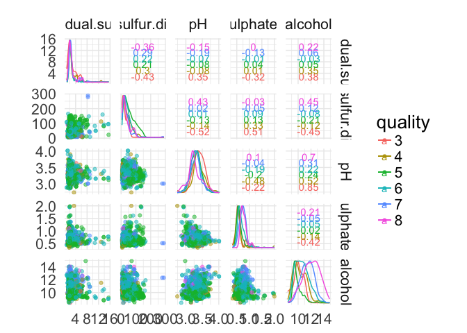

``` r
# ggscatmat(rw_subset_num, columns = 2:4, color="quality", alpha=0.8)
```

``` r
summary(rw$quality)
```

    ##   3   4   5   6   7   8 
    ##  10  53 681 638 199  18

``` r
summary(rw_subset_num$quality)
```

    ##    Min. 1st Qu.  Median    Mean 3rd Qu.    Max. 
    ##   1.000   3.000   4.000   3.636   4.000   6.000

``` r
summary(rw_subset_fact$quality)
```

    ##   3   4   5   6   7   8 
    ##  10  53 681 638 199  18

Bivariate Analysis
==================

> **Tip**: As before, summarize what you found in your bivariate explorations here. Use the questions below to guide your discussion.

### Talk about some of the relationships you observed in this part of the
investigation. How did the feature(s) of interest vary with other features in
the dataset?

### Did you observe any interesting relationships between the other features
(not the main feature(s) of interest)?

### What was the strongest relationship you found?

Multivariate Plots Section
==========================

> **Tip**: Now it's time to put everything together. Based on what you found in the bivariate plots section, create a few multivariate plots to investigate more complex interactions between variables. Make sure that the plots that you create here are justified by the plots you explored in the previous section. If you plan on creating any mathematical models, this is the section where you will do that.

    ##   volatile.acidity residual.sugar density   pH alcohol quality
    ## 1             0.70            1.9  0.9978 3.51     9.4       5
    ## 2             0.88            2.6  0.9968 3.20     9.8       5
    ## 3             0.76            2.3  0.9970 3.26     9.8       5

    ## `stat_bin()` using `bins = 30`. Pick better value with `binwidth`.
    ## `stat_bin()` using `bins = 30`. Pick better value with `binwidth`.
    ## `stat_bin()` using `bins = 30`. Pick better value with `binwidth`.
    ## `stat_bin()` using `bins = 30`. Pick better value with `binwidth`.
    ## `stat_bin()` using `bins = 30`. Pick better value with `binwidth`.

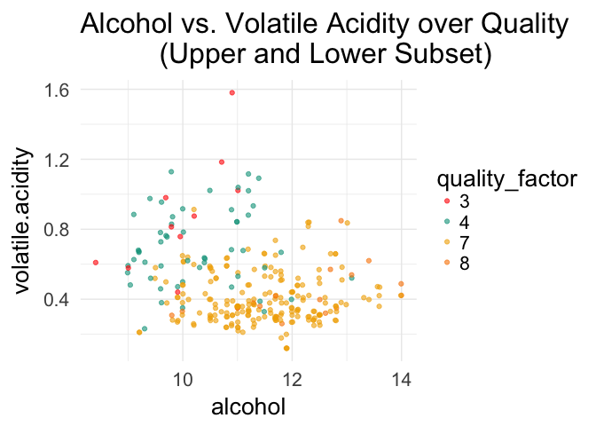

Multivariate Analysis
=====================

### Talk about some of the relationships you observed in this part of the
investigation. Were there features that strengthened each other in terms of
looking at your feature(s) of interest?

### Were there any interesting or surprising interactions between features?

### OPTIONAL: Did you create any models with your dataset? Discuss the
strengths and limitations of your model.

------------------------------------------------------------------------

Final Plots and Summary
=======================

> **Tip**: You've done a lot of exploration and have built up an understanding of the structure of and relationships between the variables in your dataset. Here, you will select three plots from all of your previous exploration to present here as a summary of some of your most interesting findings. Make sure that you have refined your selected plots for good titling, axis labels (with units), and good aesthetic choices (e.g. color, transparency). After each plot, make sure you justify why you chose each plot by describing what it shows.

### Plot One

### Description One

### Plot Two

### Description Two

### Plot Three

### Description Three

------------------------------------------------------------------------

Reflection
==========

> **Tip**: Here's the final step! Reflect on the exploration you performed and the insights you found. What were some of the struggles that you went through? What went well? What was surprising? Make sure you include an insight into future work that could be done with the dataset.

> **Tip**: Don't forget to remove this, and the other **Tip** sections before saving your final work and knitting the final report!
