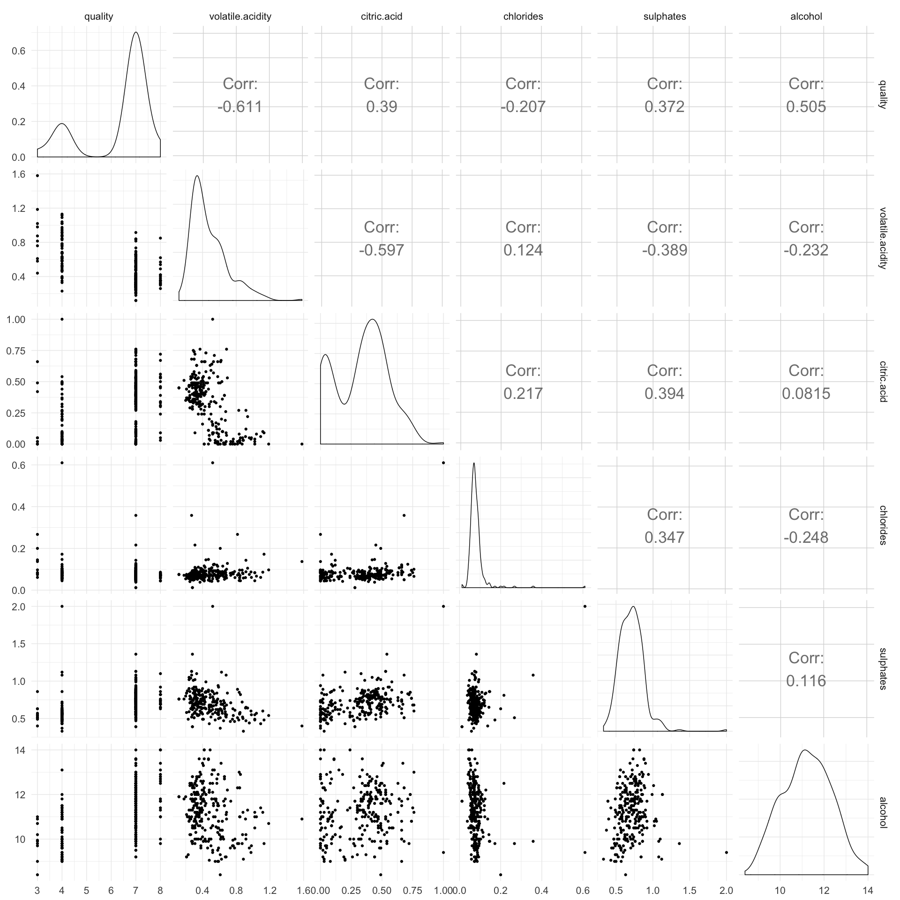
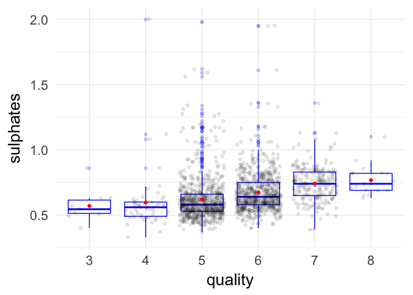
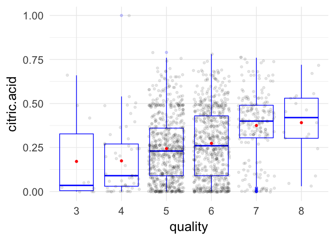
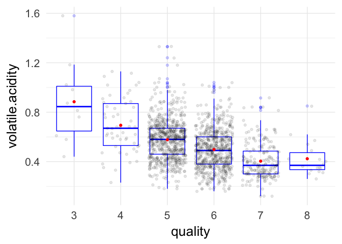
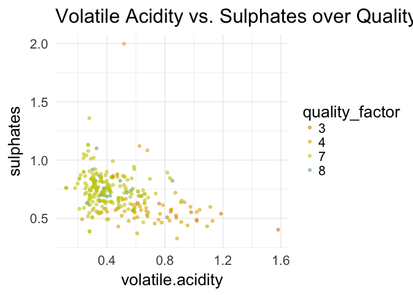

Red, Red Wine
================
Jason Horowitz
June 12, 2018

    ## ── Attaching packages ──────────────────────────────────────────────────────── tidyverse 1.2.1 ──

    ## ✔ ggplot2 2.2.1     ✔ purrr   0.2.5
    ## ✔ tibble  1.4.2     ✔ dplyr   0.7.5
    ## ✔ tidyr   0.8.1     ✔ stringr 1.3.1
    ## ✔ readr   1.1.1     ✔ forcats 0.3.0

    ## ── Conflicts ─────────────────────────────────────────────────────────── tidyverse_conflicts() ──
    ## ✖ dplyr::arrange()   masks plyr::arrange()
    ## ✖ dplyr::combine()   masks gridExtra::combine()
    ## ✖ purrr::compact()   masks plyr::compact()
    ## ✖ dplyr::count()     masks plyr::count()
    ## ✖ dplyr::failwith()  masks plyr::failwith()
    ## ✖ dplyr::filter()    masks stats::filter()
    ## ✖ dplyr::id()        masks plyr::id()
    ## ✖ dplyr::lag()       masks stats::lag()
    ## ✖ dplyr::mutate()    masks plyr::mutate()
    ## ✖ dplyr::rename()    masks plyr::rename()
    ## ✖ dplyr::summarise() masks plyr::summarise()
    ## ✖ dplyr::summarize() masks plyr::summarize()

    ## 
    ## Attaching package: 'GGally'

    ## The following object is masked from 'package:dplyr':
    ## 
    ##     nasa

    ## [1] "/Users/jasonhorowitz/Desktop/DAND/t2-p2-project-EDA"

### Intro

The objective of this project is to perform EDA (exploratory data
anlalysis) examining relationships among variables in the red wine
dataset. This is one of two datasets presented by Udacity which relate
to red and white variants of Portuguese Vinho Verde wine.

There are a total of 1599 observations (wines) in the dataset displaying
twelve variables including eleven input variables (based on
physicochemical tests) and one output variable based on sensory data, a
quality score.

The physico-chemical variables are (descriptive text from text file
included with dataset):

1.  **fixed acidity** (tartaric acid - g / dm^3): most acids involved
    with wine are fixed or nonvolatile (do not evaporate readily).
2.  **volatile acidity** (acetic acid - g / dm^3): the amount of acetic
    acid in wine, which at too high of levels can lead to an unpleasant,
    vinegar taste.
3.  **citric acid** (g / dm^3): found in small quantities, citric acid
    can add ‘freshness’ and flavor to wines.
4.  **residual sugar** (g / dm^3): the amount of sugar remaining after
    fermentation stops, it’s rare to find wines with less than 1
    gram/liter and wines with greater than 45 grams/liter are considered
    sweet.
5.  **chlorides** (sodium chloride - g / dm^3): the amount of salt in
    the wine
6.  **free sulfur dioxide** (mg / dm^3): the free form of SO2 exists in
    equilibrium between molecular SO2 (as a dissolved gas) and bisulfite
    ion; it prevents microbial growth and the oxidation of wine.
7.  **total sulfur dioxide** (mg / dm^3): amount of free and bound forms
    of S02; in low concentrations, SO2 is mostly undetectable in wine,
    but at free SO2 concentrations over 50 ppm, SO2 becomes evident in
    the nose and taste of wine.
8.  **density** (g / cm^3): the density of wine is close to that of
    water depending on the percent alcohol and sugar content.
9.  **pH**: describes how acidic or basic a wine is on a scale from 0
    (very acidic) to 14 (very basic); most wines are between 3-4 on the
    pH scale
10. **sulphates** (potassium sulphate - g / dm3): a wine additive which
    can contribute to sulfur dioxide gas (S02) levels, wich acts as an
    antimicrobial and antioxidant.
11. **alcohol** (% by volume): the percent alcohol content of the wine.
12. **quality** (score between 0 and 10):the median of at least 3
    evaluations made by wine experts with grading between 0 (very bad)
    and 10 (very excellent).

# Univariate Plots Section

Let’s take a look at the structure of the dataset and let’s also
summarize the variables:

    ## 'data.frame':    1599 obs. of  13 variables:
    ##  $ X                   : int  1 2 3 4 5 6 7 8 9 10 ...
    ##  $ fixed.acidity       : num  7.4 7.8 7.8 11.2 7.4 7.4 7.9 7.3 7.8 7.5 ...
    ##  $ volatile.acidity    : num  0.7 0.88 0.76 0.28 0.7 0.66 0.6 0.65 0.58 0.5 ...
    ##  $ citric.acid         : num  0 0 0.04 0.56 0 0 0.06 0 0.02 0.36 ...
    ##  $ residual.sugar      : num  1.9 2.6 2.3 1.9 1.9 1.8 1.6 1.2 2 6.1 ...
    ##  $ chlorides           : num  0.076 0.098 0.092 0.075 0.076 0.075 0.069 0.065 0.073 0.071 ...
    ##  $ free.sulfur.dioxide : num  11 25 15 17 11 13 15 15 9 17 ...
    ##  $ total.sulfur.dioxide: num  34 67 54 60 34 40 59 21 18 102 ...
    ##  $ density             : num  0.998 0.997 0.997 0.998 0.998 ...
    ##  $ pH                  : num  3.51 3.2 3.26 3.16 3.51 3.51 3.3 3.39 3.36 3.35 ...
    ##  $ sulphates           : num  0.56 0.68 0.65 0.58 0.56 0.56 0.46 0.47 0.57 0.8 ...
    ##  $ alcohol             : num  9.4 9.8 9.8 9.8 9.4 9.4 9.4 10 9.5 10.5 ...
    ##  $ quality             : int  5 5 5 6 5 5 5 7 7 5 ...

    ##        X          fixed.acidity   volatile.acidity  citric.acid   
    ##  Min.   :   1.0   Min.   : 4.60   Min.   :0.1200   Min.   :0.000  
    ##  1st Qu.: 400.5   1st Qu.: 7.10   1st Qu.:0.3900   1st Qu.:0.090  
    ##  Median : 800.0   Median : 7.90   Median :0.5200   Median :0.260  
    ##  Mean   : 800.0   Mean   : 8.32   Mean   :0.5278   Mean   :0.271  
    ##  3rd Qu.:1199.5   3rd Qu.: 9.20   3rd Qu.:0.6400   3rd Qu.:0.420  
    ##  Max.   :1599.0   Max.   :15.90   Max.   :1.5800   Max.   :1.000  
    ##  residual.sugar     chlorides       free.sulfur.dioxide
    ##  Min.   : 0.900   Min.   :0.01200   Min.   : 1.00      
    ##  1st Qu.: 1.900   1st Qu.:0.07000   1st Qu.: 7.00      
    ##  Median : 2.200   Median :0.07900   Median :14.00      
    ##  Mean   : 2.539   Mean   :0.08747   Mean   :15.87      
    ##  3rd Qu.: 2.600   3rd Qu.:0.09000   3rd Qu.:21.00      
    ##  Max.   :15.500   Max.   :0.61100   Max.   :72.00      
    ##  total.sulfur.dioxide    density             pH          sulphates     
    ##  Min.   :  6.00       Min.   :0.9901   Min.   :2.740   Min.   :0.3300  
    ##  1st Qu.: 22.00       1st Qu.:0.9956   1st Qu.:3.210   1st Qu.:0.5500  
    ##  Median : 38.00       Median :0.9968   Median :3.310   Median :0.6200  
    ##  Mean   : 46.47       Mean   :0.9967   Mean   :3.311   Mean   :0.6581  
    ##  3rd Qu.: 62.00       3rd Qu.:0.9978   3rd Qu.:3.400   3rd Qu.:0.7300  
    ##  Max.   :289.00       Max.   :1.0037   Max.   :4.010   Max.   :2.0000  
    ##     alcohol         quality     
    ##  Min.   : 8.40   Min.   :3.000  
    ##  1st Qu.: 9.50   1st Qu.:5.000  
    ##  Median :10.20   Median :6.000  
    ##  Mean   :10.42   Mean   :5.636  
    ##  3rd Qu.:11.10   3rd Qu.:6.000  
    ##  Max.   :14.90   Max.   :8.000

### Copying Dataframe and Transforming/Adding Variables

The first thing we are going to do is to copy the rw dataframe so that
subsequent transformations do not affect the original df. Since it will
be useful to have the quality variable in both factor and integer from,
we will create a factorized version of the quality variable
(quality\_factor). Also we will transform the X variable into a factor
(since statistically summarizing this variable is meaningless) and will
rename it to the more humanly readable “id”.

    ## 'data.frame':    1599 obs. of  14 variables:
    ##  $ id                  : Factor w/ 1599 levels "1","2","3","4",..: 1 2 3 4 5 6 7 8 9 10 ...
    ##  $ fixed.acidity       : num  7.4 7.8 7.8 11.2 7.4 7.4 7.9 7.3 7.8 7.5 ...
    ##  $ volatile.acidity    : num  0.7 0.88 0.76 0.28 0.7 0.66 0.6 0.65 0.58 0.5 ...
    ##  $ citric.acid         : num  0 0 0.04 0.56 0 0 0.06 0 0.02 0.36 ...
    ##  $ residual.sugar      : num  1.9 2.6 2.3 1.9 1.9 1.8 1.6 1.2 2 6.1 ...
    ##  $ chlorides           : num  0.076 0.098 0.092 0.075 0.076 0.075 0.069 0.065 0.073 0.071 ...
    ##  $ free.sulfur.dioxide : num  11 25 15 17 11 13 15 15 9 17 ...
    ##  $ total.sulfur.dioxide: num  34 67 54 60 34 40 59 21 18 102 ...
    ##  $ density             : num  0.998 0.997 0.997 0.998 0.998 ...
    ##  $ pH                  : num  3.51 3.2 3.26 3.16 3.51 3.51 3.3 3.39 3.36 3.35 ...
    ##  $ sulphates           : num  0.56 0.68 0.65 0.58 0.56 0.56 0.46 0.47 0.57 0.8 ...
    ##  $ alcohol             : num  9.4 9.8 9.8 9.8 9.4 9.4 9.4 10 9.5 10.5 ...
    ##  $ quality             : int  5 5 5 6 5 5 5 7 7 5 ...
    ##  $ quality_factor      : Factor w/ 6 levels "3","4","5","6",..: 3 3 3 4 3 3 3 5 5 3 ...

### Structure and Summary of Data

The original dataset consists of 12 variables (plus an index (X) which
identifies the different wines). The variables are all number or integer
data types. There are a total of nearly 1600 observations in the
dataset. There are no missing values and each row of the database equals
one observation: so the dataset is both clean and tidy.

### Histogram of Wine Quality Scores

For our first histogram, we will plot the wine quality scores. It is
notable that greater than 75% of the quality scores are concentrated in
the middle (5-6) of the score range (1-10). The shape of the curve is
normal-ish.

Also worth noting is that the Quality score is an integer data type
despite the description that it is derived from observations of at least
3 experts. It would have been nice to have the precision of a decimal
average for quality scores. On the other hand, it simplifies things by
making a bin = 1 optimal for displaying the distribution.

In fact, since the ratings are distributed across six integers (3-8), it
made sense to convert this into a factor variable. The results coincide
with the following qualitative (subjective) ratings:

  - 3 = “Awful”
  - 4 = “Poor”
  - 5 = “Fair”
  - 6 = “Good”
  - 7 = “Very Good”
  - 8 = “Superior”

<!-- -->

Following is the summary count of wines by quality score.

    ##   3   4   5   6   7   8 
    ##  10  53 681 638 199  18

### Histograms of Other Variables

Let’s look at histograms of the other variables adjusting the binwidth
as appropriate to have a look at the distribution of values. I will also
perform transformations on plots that require normalization.

I hope that plotting variables and some minor additional research into
them will give us ideas for further investigation in the bivariate and
multivariate analysis to follow.

#### Fixed Acidity

<!-- --> Since
this appears to have a long-tail distribution, we will transform the
variable using the log base 10 scale.

<!-- -->

With this transformation, the distribution of the data follows a more
normal distribution.

#### Volatile Acidity

<!-- -->

The distribution for volatile acidity also seems to be longtailed - and
with some outliers. Let’s perform a similar log10 transformation - also
eliminating the top and bottom 1% of the
    values.

    ## Scale for 'x' is already present. Adding another scale for 'x', which
    ## will replace the existing scale.

<!-- -->

As with fixed acidity, the transformed volatile acidity data follows a
somewhat more normal distribution.

#### Citric Acid

<!-- -->

A signicant number of wines have citric acid near 0. Let’s check how
many actually have no trace of citric acid.

    ## [1] 132  14

    ## [1] 0.08255159

So 132 items (8.2% of the observations) contain no trace of citric acid.
This makes sense because the citric acid most usally found in wine is a
supplement added after primary alcohol fermentation (citric acid is
present only in minute quantities in grapes) In the European Union, use
of citric acid for acidification is prohibited, but limited use of
citric acid is permitted for removing excess iron and copper from the
wine if potassium ferrocyanide is not available.
[Wikipedia](https://en.wikipedia.org/wiki/Acids_in_wine#cite_note-Oxford_pg_171-6)

Also note - Citric acid imparts a citric character that enhances the
taste of many white and blush wines. However, citric acid is seldom used
in red wine. The distinctive citric taste may not be appropriate for
many types of red wine. In addition, the risk of biological instability
is much greater in red wines.[Lum Eisenman, *The Home Winemaker’s
Manual*](https://www.homebrewit.com/a-detailed-explanation-of-acids-used-in-wine-making)

The description that came with the dataset about citric acid adding
‘freshness and flavor’ to wine seems as though it may not apply to red
wines. It certainly will be interesting to see how citric acid (or its
absence) correlates with wine quality in this particular dataset. It’s
also worth noting that most wines in this dataset do contain traces of
citric acid even though these are all red wines.

#### Total Acid

Let’s compute the sum of the three forms of acid identified in the
dataset to make a ‘total.acidity’ variable. I would hypothesize that
this sum should have a very strong negative correlation with pH (see
below) in which the lower the value, the stronger the acid.

Next, let’s look at the structure of the new variable.

    ##    Min. 1st Qu.  Median    Mean 3rd Qu.    Max. 
    ##   5.270   7.827   8.720   9.118  10.070  17.045

Glancing at the summary values, it looks like this is going to be
right-skewed with a long tale at the higher values. Let’s plot a
histogram to confirm.

<!-- -->

Yep, that hypothesis was correct.

#### Residual Sugar

<!-- -->

Residual sugar seems to have a very long tail, so let’s perform a log 10
transformation.

<!-- -->

Still a long tail, but the middle of the distribution is more clearly
normalish. Let’s try doing this a different way to see if we can
eliminate the outliers.

<!-- -->

That’s a little better.

#### Chlorides

This is the amount of salt (sodium chloride) found in the wine.

<!-- -->

Chlorides definitely has a long-tail, so let’s try removing the
outliers. I have never experienced salt in wine as a good thing, so it
would also be interesting to examine the outliers on the high end of the
scale.

<!-- -->

This plot definitely is more normal in its appearance than the previous
one.

#### Free Sulfur Dioxide

<!-- -->

#### Total Sulfur Dioxide

<!-- -->

Sulfur dioxide in both its free and bound form is used as a preservative
(see above). Since the plots for both are right skewed, let’s perform a
square root transformation on each.

First on the free sulfur dioxide:

<!-- -->

And total sulfur dioxide

<!-- -->

That mostly got rid of the right skew and the curves are more normal.

#### Density

<!-- -->
Density is a quite a normal distribution with few outliers: the mean and
median are almost identical.

    ##    Min. 1st Qu.  Median    Mean 3rd Qu.    Max. 
    ##  0.9901  0.9956  0.9968  0.9967  0.9978  1.0037

#### pH (Overall Acidity)

<!-- -->

pH (overall acidity) also shows a normalish distribution with few
outliers.

#### Sulphates

<!-- -->

Sulphates, an additive which serves as a preservative, demonstrates a
right skewed curve with a long tail. Let’s see what how it looks after a
square root transformation.

<!-- -->

That’s normalish.

#### Alcohol Content % By Volume

<!-- -->

Let’s summarize the alcohol variable:

    ##    Min. 1st Qu.  Median    Mean 3rd Qu.    Max. 
    ##    8.40    9.50   10.20   10.42   11.10   14.90

Alcohol content by volume is slightly right-skewed and in the 9.5-11
range. This is fairly intutive to anyone who drinks wine. It will be
interesting to look at correlations between high/low alcohol content and
the quality score.

# Univariate Analysis

### What is the structure of your dataset?

The structure of the dataset is as discussed in the “Structure and
Summary” section above. One major transformation we made in EDA was
creating a factorized version of the quality variable. Another
transformation was adding a variable - total.acidity - which is the sum
of the three acid(ity) variables.

### What is/are the main feature(s) of interest in your dataset?

The main feature of interest is the distribution of the quality
variable. More than three-quarters of the observations are of the middle
two ratings which means that only about 400 items were classified at
either the upper or lower extremes. It should be possible to examine
that group of ‘very good’ or ‘very bad’ wines and to correlate with
other variables.

A few of the input variables appear to be related to each other: the
variables related to acidity and to sulfur dioxide. It will be
interesting to see how those items correlate with each other and with
the quality
score.

### What other features in the dataset do you think will help support your investigation into your feature(s) of interest?

Biggest question for me is how/whether the different input variables
correlate or predict the output variable, quality. Am particularly
curious to see how alchohol level correlates with quality. Will also be
interesting to see how the different acidity-related variables correlate
with each other and with
quality.

### Did you create any new variables from existing variables in the dataset?

As mentioned previously, I did create a total.acidity variable by
summing up three other acid(ity) variables and we also transformed two
of the existing variables: (‘X’ and ‘quality’) into factor variables. We
don’t need these variables to be summarized and it makes more intuitive
sense for these variables to be
factors.

### Of the features you investigated, were there any unusual distributions?  

## Did you perform any operations on the data to tidy, adjust, or change the form  

### of the data? If so, why did you do this?

Yes, several of the variables’ plots displayed a skew or a relatively
large number of outliers. I transformed these variables using base-10
logarithims, square root operations, or, in a couple cases, by cutting
off the outliers. As a result, the transformed plots were easier to read
and showed more normal distributions.

# Bivariate Plots Section

To get started with the bivariate analysis, we will subset the dataframe
to plot acid-related variables with each other and against quality. The
rw\_acid dataframe has the following structure:

    ## 'data.frame':    1599 obs. of  6 variables:
    ##  $ quality         : int  5 5 5 6 5 5 5 7 7 5 ...
    ##  $ pH              : num  3.51 3.2 3.26 3.16 3.51 3.51 3.3 3.39 3.36 3.35 ...
    ##  $ total.acidity   : num  8.1 8.68 8.6 12.04 8.1 ...
    ##  $ fixed.acidity   : num  7.4 7.8 7.8 11.2 7.4 7.4 7.9 7.3 7.8 7.5 ...
    ##  $ volatile.acidity: num  0.7 0.88 0.76 0.28 0.7 0.66 0.6 0.65 0.58 0.5 ...
    ##  $ citric.acid     : num  0 0 0.04 0.56 0 0 0.06 0 0.02 0.36 ...

Following is a plot of rw\_acid (made using the ggpairs function of the
ggally library). Note that we are using the integer quality variable so
that the function can calculate correlation coefficients.

<!-- -->

As expected, the correlations among the acid-related variables are quite
high and in some cases approach 1.

The greatest correlations between acidity and quality are volatile
acidity (negative correlation - medium) and citric acid (positive
correlation - weak). Volatile acidity of wine is aceitic acid which at
high quantities gives the taste of [balsamic
vinegar](https://winefolly.com/tutorial/wine-faults/) so the negative
correlation is not surprising. Citric acid is a flavor enhancer in white
wines, but as noted above is not allowed by the EU in red wine, so the
positive correlation is a bit more surprising. Perhaps iron and copper
are introduced via the grape crushing process and citric acid is used
(as permitted) to remove their traces.

I was surprised at the nearly 100% correlation between fixed acidity and
total acidity, but a visual inspection of the dataframe shows that I
should not have
    been.

    ##      quality   pH total.acidity fixed.acidity volatile.acidity citric.acid
    ## 1255       5 3.40          8.56           7.8             0.70        0.06
    ## 813        5 3.24         11.58          10.8             0.45        0.33
    ## 156        5 3.42          7.95           7.1             0.43        0.42

Fixed acidity is by far the largest component of total acidity in grams
per volume (dm^3). Since the definition of a ‘fixed’ acid is that it
does not easily evaporate, this makes sense. There is hardly any
correlation between either total or fixed acidity and quality.

### Alcohol and Residual Sugar

Let’s examine another conceptually related pair of variables: alchohol
and residual.sugar. Since alcohol in wine is created during fermentation
by chemical reaction with sugar in grapes, our hypothesis is the higher
the level of alcohol, the lower the amount of residual sugar.

We again subset the dataframe in order to view the following
scatterplot.

Let’s view a scatterplot of residual sugar vs. alchohol (faceted by
quality). In order to make the high and low quality wines more visible,
I filtered out the 75% of observations in the medium quality (5-6)
range.

<!-- -->

It actually does look as though the superior quality scores (8) tend to
be higher in alcohol content (though a bit all over the place in terms
of residual sugar). The wines that scored lower in quality (3-4) are
grouped on the lower side of the alcohol/volume scale (and are also all
over the place in terms of residual sugar).

Let’s look at the actual correlation for the entire sample between
alcohol content and residual sugar.

    ## [1] 0.04207544

Hypothesis here appears to be incorrect since the correlation
coefficient is very small. A little Google research on wine yields some
clues - see the following citations.

> Since we’ve noted that fermentation converts grape sugars to alcohol,
> there’s definitely a relationship between a wine’s residual or
> unconverted sugar and its alcohol level. The more residual sugar, the
> lower the potential alcohol that wine could have. But it’s not a
> simple relationship—there are other factors at play, particularly how
> much sugar the grapes had to begin with. Two wines could have widely
> different alcohol percentages but the same amount of residual sugar—or
> vice versa—depending on how ripe the grapes were. [Wine
> Spectator](https://www.winespectator.com/drvinny/show/id/50489)

> So, while there’s definitely a loose relationship between a wine’s
> residual sugar and its alcohol level, it’s not a simple relationship.
> [EverWonderWine?
> Blog](https://www.everwonderwine.com/blog/2017/1/14/is-there-a-relationship-between-a-wines-alcohol-level-and-its-sweetness)

Since it is alcohol content that has the greater correlation with
quality, we’ll use it in the subsequent plots.

Let’s examine another scatterplot matrix, this time using those
variables which we suspect may be correlated with quality:

  - volatile acidity
  - citric acid
  - chlorides
  - sulphates
  - alcohol

This time we’ll subset using the dplyr library.

<!-- -->

The correlation coefficients are pretty informative; the plots somewhat
less so. The input variables that correlate with quality are:

  - volatile acidity - medium (negative) 0.391
  - citric acid - low 0.226
  - sulphates - low 0.251
  - alcohol - medium 0.476

The input variables that correlate with other variables are:

  - citric acid and volatile acidity - medium (negative) 0.552
  - citric acid and chlorides - low 0.204
  - citric acid and sulphates - medium 0.313
  - chlorides and sulphates - medium 0.371
  - sulphates and volatile acidity - low (negative) 0.261
  - alcohol and chlorides - low (negative) 0.221
  - alcohol and volatile acidity - low (negative) 0.202

Alright, I’m going to run the same scatterplot using the dataframe with
the 5-6 quality range filtered out to see if anything stands out at the
high and low ranges.

<!-- -->

The correlations are slightly stronger for wines at higher and lower
quality ratings which make the scatterplots easier to interpret. We will
look at some of the multi- variate plots with the same filter.

## Boxplots for Key Input Variables Across Quality

The following series of boxplots will visualize the input variables with
higher correlation coefficients across the factorized Quality variable.

### Alcohol and Quality

<!-- -->

The correlation of higher alcohol/volume with higher quality is clearly
seen here particularly at the higher quality ratings.

### Alcohol/Volume Summarized by Quality Level

These are the summary stats which are depicted in the above boxplot.

    ## factor(rw_copy$quality): 3
    ##    Min. 1st Qu.  Median    Mean 3rd Qu.    Max. 
    ##   8.400   9.725   9.925   9.955  10.575  11.000 
    ## -------------------------------------------------------- 
    ## factor(rw_copy$quality): 4
    ##    Min. 1st Qu.  Median    Mean 3rd Qu.    Max. 
    ##    9.00    9.60   10.00   10.27   11.00   13.10 
    ## -------------------------------------------------------- 
    ## factor(rw_copy$quality): 5
    ##    Min. 1st Qu.  Median    Mean 3rd Qu.    Max. 
    ##     8.5     9.4     9.7     9.9    10.2    14.9 
    ## -------------------------------------------------------- 
    ## factor(rw_copy$quality): 6
    ##    Min. 1st Qu.  Median    Mean 3rd Qu.    Max. 
    ##    8.40    9.80   10.50   10.63   11.30   14.00 
    ## -------------------------------------------------------- 
    ## factor(rw_copy$quality): 7
    ##    Min. 1st Qu.  Median    Mean 3rd Qu.    Max. 
    ##    9.20   10.80   11.50   11.47   12.10   14.00 
    ## -------------------------------------------------------- 
    ## factor(rw_copy$quality): 8
    ##    Min. 1st Qu.  Median    Mean 3rd Qu.    Max. 
    ##    9.80   11.32   12.15   12.09   12.88   14.00

Only the wines rated “5” diverge from the general pattern.

### Sulphates and Quality

<!-- -->

The correlation between sulphates and quality is weak, but nevertheless
visible.

### Citric Acid and Quality

<!-- -->

The correlation between citric acid and quality is also visible here.
However the overlap in values indicated by the interquartile ranges and
the substantial number of wines with no citric acid (discussed above)
discount the correlation.

### Volatile Acidity and Quality

<!-- -->

The inverse correlation between volatile acidity and quality is visible
here. This is the second-strongest correlation after
alchohol.

# Bivariate Analysis

### Talk about some of the relationships you observed in this part of the investigation.  How did the feature(s) of interest vary with other features in  the dataset?

Much of this analysis is offered inline (see above above).

The two strongest relationships with quality variable are the positive
correlation with alcohol and the negative one with volatile acidity. If
I were to create a model predicting which items account for most of a
high quality score it would be based on these two variables. Show me a
vinho verde with high alcohol content per volume and low volatile
acidity and I’ll bet you it’s highly-rated
wine.

### Did you observe any interesting relationships between the other features (not the main feature(s) of interest)?

Yes,the positive correlations among the various acids and
acidity-related variables confirms the validity of the data. It was also
interesting not to find an expected (negative correlation beteween
alcohol and residual sugar level).

### What was the strongest relationship you found?

The strongest relationship in this dataset is between alcohol and
quality and also among the various acidity variables.

# Multivariate Plots Section

#### Volatile Acidity and Alcohol Over Quality

These are the two strongest relationships with quality - volatile
acidity is a negative correlation and alcohol is a positive one. Setting
up alcohol on the x-axis and volatile acidity on the y-axis, I would
expect to see most of the high quality wine in the lower right-hand
portion of the plot and the lower-quality ones on the upper left. To
make the visualization more comprhensible, I’m going to plot a subset
excluding the 1200 values in the medium (5-6) quality range.

<!-- -->

Bingo\! This was exactly what we were expecting.

For completeness, here are same items plotted for the entire dataset.

<!-- -->

This plot is harder to read, but if you examine it carefully, it shows
the same trend.

#### Alcohol vs. Sulphates Over Quality

Sulphates (“a wine additive which acts as an antimicrobial and
antioxidant”) correlates weakly with both quality and volatile acidity.
Let’s plot the relationships among these three variables.

<!-- -->

The relationship between alcohol/volume and quality is again clearly
visible; the correlation between sulpahates, quality and alcohol is
weak, but also visible.

#### Volatile Acidity vs. Sulphates Over Quality

<!-- -->

Since sulphates and volatile acidity have a negative correlation and
both have a relationship with quality, I though I might see a pretty
clear negative slope in this plot. There is a slight negative slope
indicating the correlation between the two input variables. And these
seem to correlate with quality, but honestly, relationships are not as
clear as I had
hoped.

# Multivariate Analysis

### Talk about some of the relationships you observed in this part of the investigation. Were there features that strengthened each other in terms of looking at your feature(s) of   interest?

We examined a number of the factors that ggpairs had shown to have
relatively high correlation and plotted them with quality as a
factor.

### Were there any interesting or surprising interactions between features?

The plot of alcohol and volatile acidity against quality factors
confirmed that these were the strongest
correlations.

### OPTIONAL: Did you create any models with your dataset? Discuss the strengths and  limitations of your model.

I did not create any models with the dataset. This is something I would
certainly do for the more polished analysis after the EDA phase. ——

# Final Plots and Summary

### Plot One

#### Histogram of the Quality Variable

<!-- -->

And here is the summary distribution of that variable:

    ##   3   4   5   6   7   8 
    ##  10  53 681 638 199  18

### Description for Plot One

Sometimes the most descriptive stats are the simplest count statistics.
This is one of those cases: over 75% of the quality scores fall in the
medium (5-6) range so the task of analyzing this data is going to learn
what are the variables that drive the top and bottom ranges.

### Plot Two

#### Boxplots of Alcohol and Volatile Acidity Faceted by Quality

<!-- -->

### Description Two

There are several ways to understand the correlation between quality and
alchohol and quality and volatile acid, but in my view the box plots are
the best visualization. Not only do they show that as the input
variables change, the quality score increases or decreases, but the
overlap in the ranges is also indicative.

### Plot Three

#### Multivariate Scatterplot Alcohol/Volatile Acidity/Quality

    ## Scale for 'colour' is already present. Adding another scale for
    ## 'colour', which will replace the existing scale.

<!-- -->

### Description Three

This is the plot which shows most clearly the two greatest relationships
with Quality as discussed above. Setting up alcohol on the x-axis and
volatile acidity on the y-axis, I expected to see most of the high
quality wine in the lower right-hand portion of the plot and the
lower-quality ones on the upper left. The plot is easier to understand
with the middle values removed.

-----

# Reflection

This project demonstrates the power of R and the GGPlot libarary to
create visualizations that help an analyst to better understand a
dataset before starting with advanced analytics. Using a pre-cleaned and
tidied red wine dataset eliminated some of the difficulties inherent in
data wrangling, but because the data is limited it also reduced the
possibilities for interesting discovery.

While there are clear relationships among variables - notably alcohol,
volatile acidity, and quality - this is the place to note the axiom
“correlation does not imply causation.” Knowing what I know
intuitively as a wine drinker myself, in particular I wouldn’t even
generalize these relationships to all wines, but would focus further
investigation on specific qualities of Vinho Verde. I don’t think it is
true that higher alcohol wines are generally higher quality, but that
seems to be the case within the Vinho Verde family and it would be worth
exploring.

For further exploration, I would proceed with the following:

1.  I would build a linear model using the 3 or 4 variables that
    correlate with quality to understand the extent to which the
    combinations account for variation in quality.
2.  I would conduct a similar exploration using the white whine (vinho
    verde) dataset. It would be particularly interesting to see if the
    citric acid correlations are the stronger, the same or weaker since,
    in general, citric acid is much more prevalent and beneficial in
    white wines.
3.  I would look for a similar dataset from a different family of wines
    and, if such data could be obtained, I would run a similar EDA over
    it.
